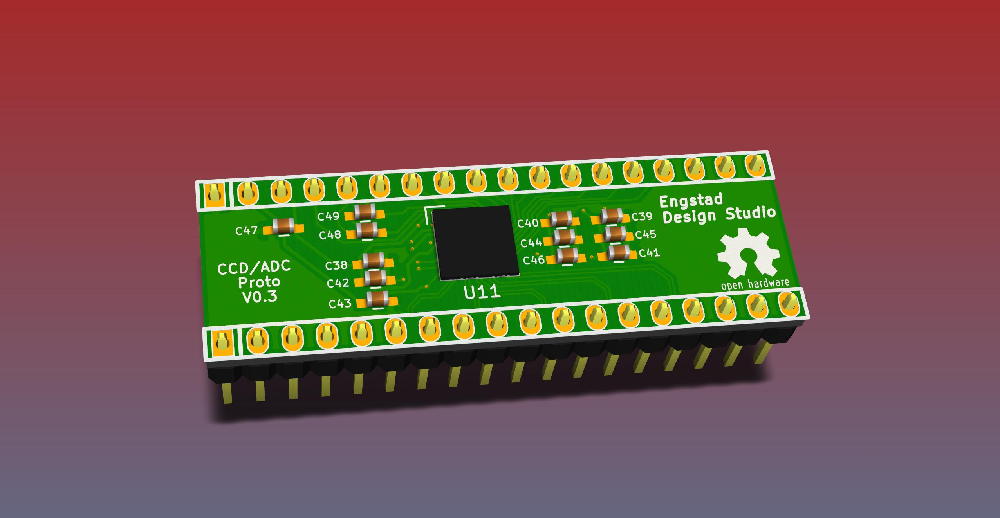

# AstroCam

My hobby project is to create a camera suitable for astronomy pictures. Here you can follow my work. It is slow going, since I don't have much time to allocate for this. So don't expect too many updates.

For now I have been focusing on three things:

1. understanding Analog Device's H-driver and ADC chip ADDI7013,
2. creating the power circuitry required for the many chips,
3. creating the PCB for the CCD camera chip.

